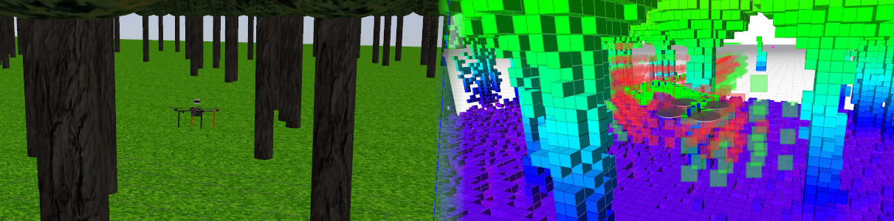

# Octomap Mapping & Planning

Metapackage containing MRS Octomap-based 3D mapper and planner.



## Dependencies

* [mrs_uav_core](http://github.com/ctu-mrs/mrs_uav_core)
* [mrs_uav_modules](http://github.com/ctu-mrs/mrs_uav_modules)

## Packages

* mrs_octomap_mapping_planning - launch files, example tmux session
* [mrs_octomap_server](https://github.com/ctu-mrs/mrs_octomap_server) - Uses Octomap to build global & local map
* [mrs_octomap_planner](https://github.com/ctu-mrs/mrs_octomap_planner) - 3D planner for UAVs
* [mrs_octomap_tools](https://github.com/ctu-mrs/mrs_octomap_tools) - MRS Tools and libraries for Octomap

## Example session

Example tmuxinator session is provided in the `tmux` subfolder.

## Main launch file

The [launch file](./ros_packages/octomap_mapping_planning/launch/mapplan.launch)
```
./ros_packages/octomap_mapping_planning/launch/mapplan.launch
```
was prepared to launch

* PointCloud filter ([mrs_pcl_tools](https://github.com/ctu-mrs/mrs_pcl_tools)),
* Octomap Server,
* Octomap Planner,
* Octomap RVIZ Visualizer,
* Nodelet manager.

Please, use provided arguments and custom config files to customize the behaviour of the nodes.
